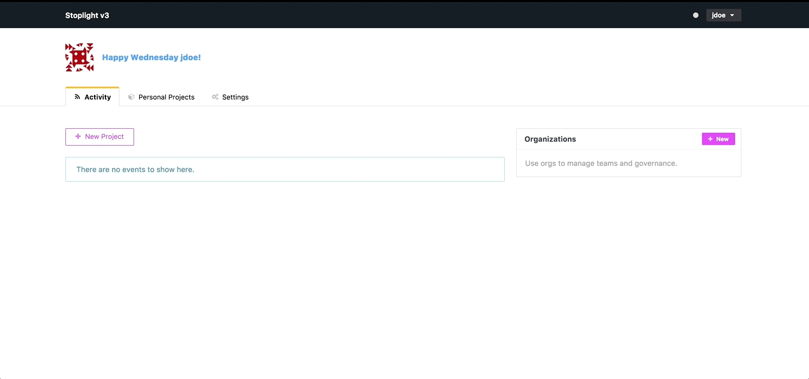

# Change Your Username 

## What 
You can change your username at any time 

## How 
1. Click on your current **username** in the top right 
2. Click on **Account** 
3. Under **Basic Info**, input a new username 
4. Click **Save** 

---
**Related Articles**
- [Sign In to Stoplight](/platform/getting-started/account-basics/sign-in) 
- [Edit Your Profile](/platform/getting-started/account-basics/edit-profile)
- [Manage Your Password](/platform/getting-started/account-basics/manage-password)
- [Change Your Email Address](/platform/getting-started/account-basics/change-email) 
- [Sign Out of Stoplight](/platform/getting-started/account-basics/sign-out) 
- [Deactivate Your Stoplight Account](/platform/getting-started/account-basics/deactivate)
