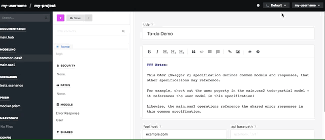
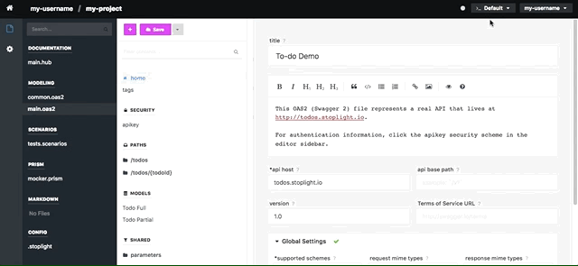

# Editor Configuration



The Stoplight editor includes an embedded configuration system that can be used to auto-populate environment information and other variables (hostnames, ports, passwords, etc.) utilized by specifications, scenarios, or collections. To setup the editor configuration, click the icon towards the top right of the editor screen immediately to the left of your username.


## Private Variables

The left-half of the configuration window is dedicated to "Private Variables", which are variables that are _only_ stored locally on your system and are never sent to Stoplight. Private Variables should be reserved for secrets specific to you, such as user-specific passwords, API keys, and other pieces of sensitive data.

## Resolved Variables 

The right-half of the configuration window displays "Resolved Variables", which is a read-only view of the variables currently exposed to your editor based on your current environment. These variables are stored in the `.stoplight` file included in your project (under "Config" in the File Explorer). To update the default or environment-specific variables stored in Stoplight, click the "Manage Environments" button under the configuration window.



Variables stored in your configuration are in JSON, and can be referenced using the following format:

```
{$$.env.myVariable}
```

Where `myVariable` is the name of the variable in your configuration.
