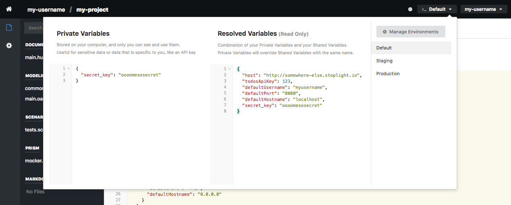
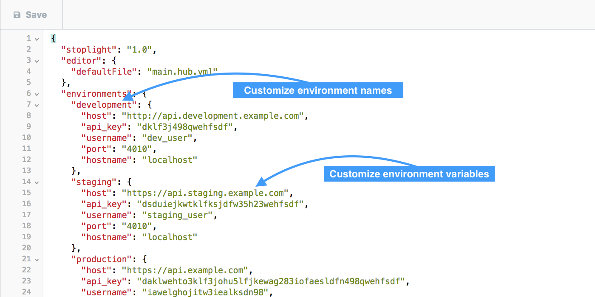

# Editor Configuration

The Stoplight editor includes an embedded configuration system that can be used to auto-populate variables (hostnames, ports, passwords, etc.) used by specifications and scenarios. These variables allow you to share commonly-used settings between members of your team directly from the Stoplight interface. You can also inject them into models and tests depending on the environment in use.

### Updating and Using Variables



Configuration variables are stored in the `.stoplight` file included in your project. Variables stored in the configuration must be specified using JSON format, and can be referenced from specifications and scenarios using the following template format:

```
{$$.env.myVariable}
```

Where `myVariable` is the name of the variable in your configuration.

### Variable Environments



All variables stored in the Stoplight editor are scoped by environment. The default environments for new projects are:

* __Default__ - The __Default__ environment is used by the Stoplight editor when first logging in, and if no other environment has been selected. This is commonly used for variables needed for development and prototyping.
* __Staging__ - The __Staging__ environment is automatically created for storing of "staging" or "pre-production" variables and settings.
* __Production__ - The __Production__ environment is automatically created for storing of production variables and settings.

The environment names and variables are defined in the `.stoplight` file in your project, and can be customized by editing the `environments` key of the `.stoplight` file.
