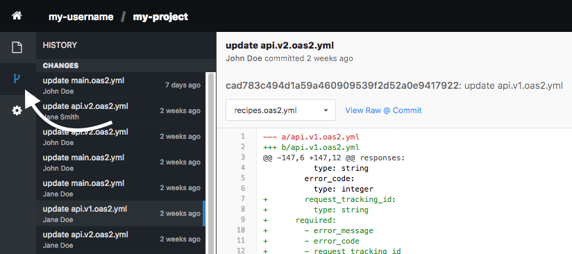
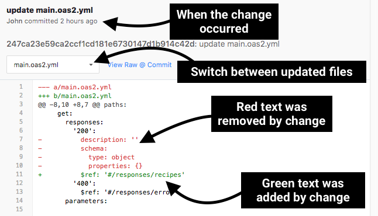

# Viewing Changes

As more users edit files within the same project, tracking changes over time
becomes increasingly difficult. To mitigate these effects, Stoplight provides the full history of changes, which allows you to view and track any changes made.

To see the history of changes for a project, use the 'History' button on the
navigation bar to the left of the project window (shown below). When the history
is being viewed, you will see a series of changes for the project, listed in
descending order by date.

Each change event includes:

* The date when the change was made

* The user who made the change

* The files updated by the change

* The differences (known as the 'diff') between each file before and after the
  change occurred

See the image below for an overview of the contents of the change view.

---

**Related**

* [Working with Files](./working-with-files.md)
