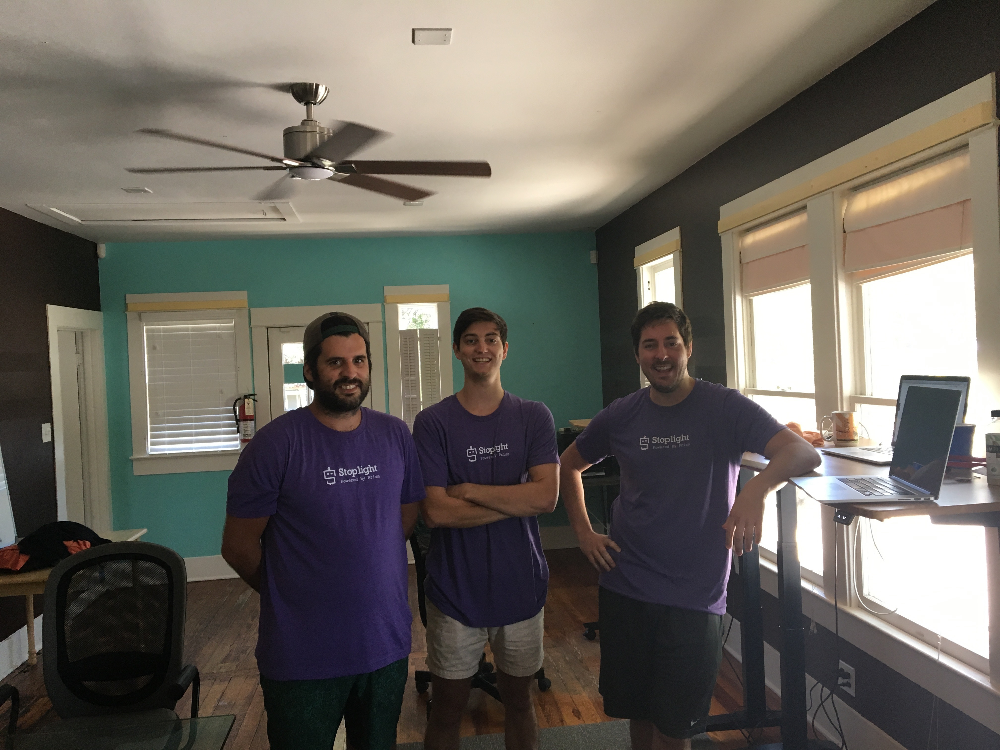

# Welcome to Stoplight NEXT! 

Now that you have the basics on what the [Stoplight Next Platform](../what-is-stoplight.md) is, we can go over how to get started. 

First things first, are you using Stoplight for Personal Projects or as part of an Organization?

## Personal Projects 
1. [Sign In](/platform/getting-started/accountbasics/signin)
2. [Create a Project](./create-project.md) 

## Organization 
1. [Sign In](/platform/getting-started/accountbasics/signin)
2. [Create an Organization](./create-org.md) 
3. [Invite Members](./managing-people.md) 
4. [Create a Project](./create-project.md) 

## Web App or Download 
* You can log in to the Web App at [next.stoplight.io](http://next.stoplight.io) or 
* You can download the platform [here](https://github.com/stoplightio/desktop/releases/latest) 

If you have any questions you can reach out to us through Intercom or email us at [support@stoplight.io](support@stoplight.io) otherwise... **Full Steam Ahead!**
