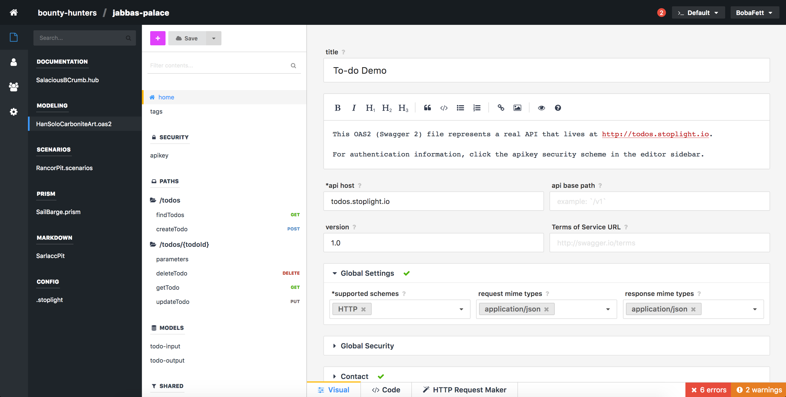
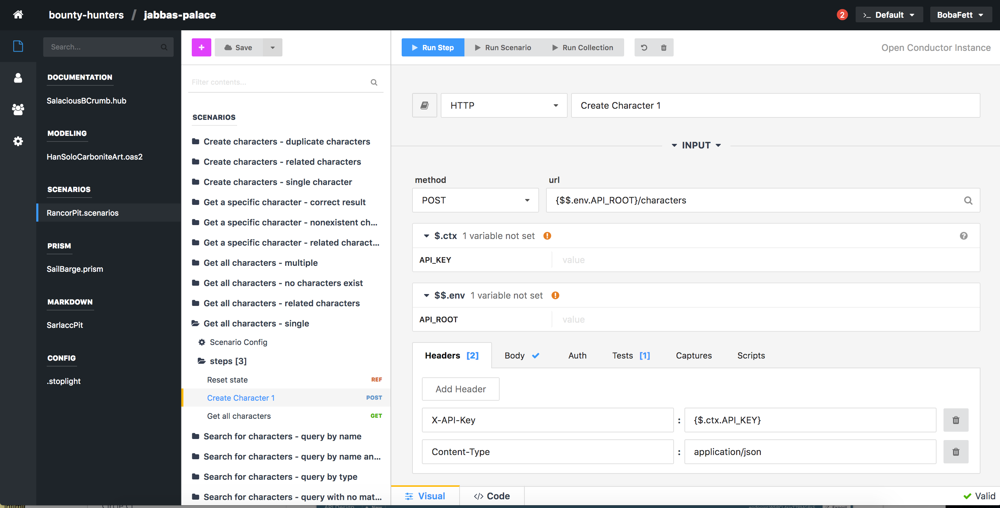
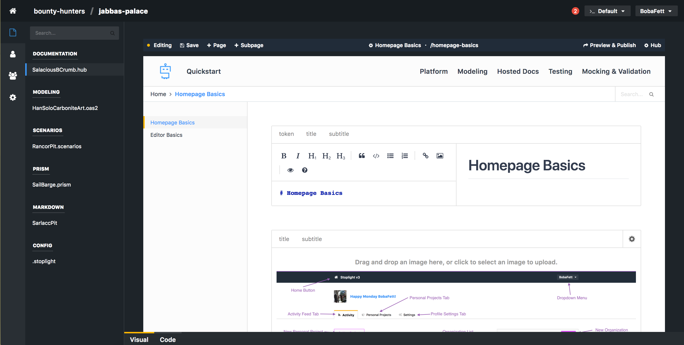

# The Stoplight Platform 
The Stoplight platform provides a suite of products that cover the entire pre-production API lifecycle. Here is an overview of the platform:

 

Stoplight promotes a design-first philosophy. Developing good design-first practices at your organization will minimize future cost, speed up your time to market, and lead to more consistent, higher quality APIs.

## API Modeling & Design
At Stoplight, everything starts with design. Our visual designer makes it easy for anybody in your organization to model and document APIs, no matter the complexity.

Whether you have an existing OpenAPI (Swagger) or are creating a new API design from scratch, we've got you covered.

## API Testing
Once you have your API design / documentation, how do you make sure that it remains accurate over time? Stoplight contract testing, powered by Prism, makes it trivial to create a full suite of tests that apply your API documentation (your contract) to your API. Run these tests from the Stoplight app, and standalone in your CI process or elsewhere.

## Documentation 

You have your API designed and documented privately in the Stoplight app, and now you want to share all or part of it with 3rd parties (developers, customers, clients, etc). Stoplight makes it easy to publish your documentation to the world, with a single click.

## Mock Server
Stoplight provides a complete mock server for every API described in the app. Run tests against this mock server, build consumers (like mobile apps, SDKS, etc) before the final API is ready, and more.

