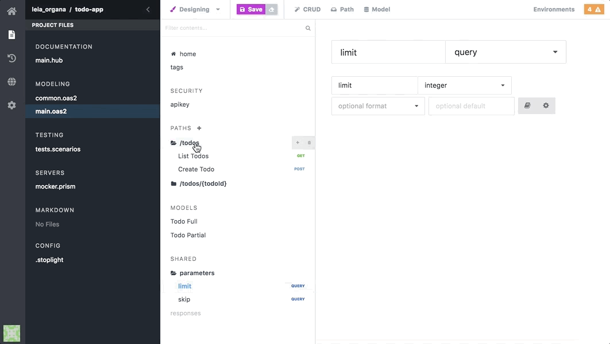
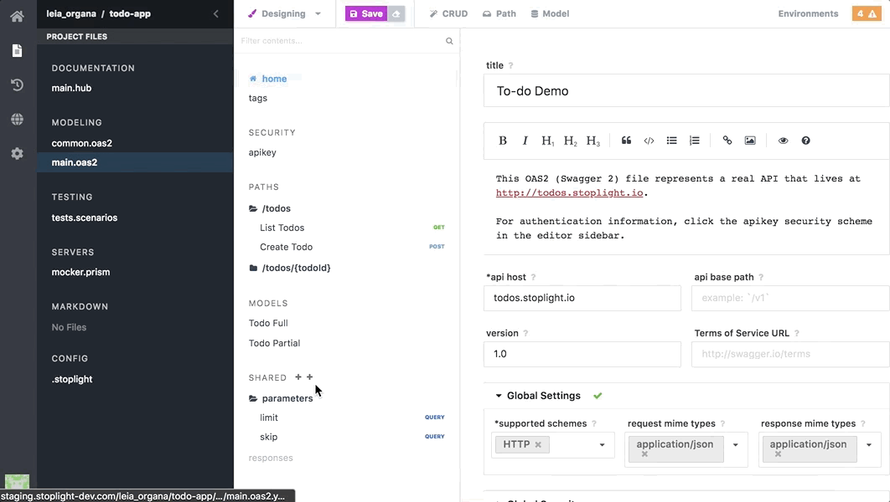

# Shared Parameters and Responses

While designing API's in Stoplight, it is common to have multiple endpoints
share a common set of query parameters and API responses. To help reduce extra
work (and the chance of introducing errors), it is important to identify
endpoints with common parameters, and, instead of rewriting the properties for
each individual endpoint, use _shared properties_ to reference the same property
multiple times.

Shared properties in Stoplight come in two forms:

* __Parameters__ - These are shared parameters that can be applied to requests
  across multiple endpoints.

* __Responses__ - These are shared responses that can be used for applying the
  same response object to multiple endpoints.

## Parameters

Shared parameters provide a way to re-use request properties across multiple API
endpoints without having to duplicate effort.

Shared parameters can be used as the following request properties:

  * __path__ - Specifies that the shared parameter can only be used in an API
    endpoint as a URL _path_
  * __query__ - Specifies that the shared parameter can only be used in an API
    endpoint as an [URL query
    string](https://en.wikipedia.org/wiki/Query_string)
  * __header__ - Specifies that the shared parameter can only be used in an API
    endpoint as a [HTTP Header field
    object](https://en.wikipedia.org/wiki/List_of_HTTP_header_fields)
  * __body__ - Specifies that the shared parameter can only be used in an API
    endpoint as a [HTTP message
    body](https://en.wikipedia.org/wiki/HTTP_message_body)
  * __form-data__ - Specifies that the shared parameter can only be used in an
    API endpoint as a HTTP body in the
    [`multipart/form-data`](https://developer.mozilla.org/en-US/docs/Web/API/FormData)
    format 

In addition to being able to specify the format of the shared parameter, you can
also apply the same type and format validations available to typical request
objects, including: the type, the default value, the minimum/maximum length, or
applying a regular expression (regex).

To use a shared parameter, navigate to an API endpoint's _Request_ section and
create a reference to the shared parameter using the "chain" button as shown in
the image above. Once the parameter has been referenced, any updates to the
shared parameter will automatically be propagated to every endpoint using that
parameter.

Like other references in Stoplight, shared parameters can also be shared across
files, projects, and other external sources.

## Shared Responses

Shared responses provide a way to re-use response objects across multiple API
endpoints without having to duplicate effort. Similar to shared properties
discussed above, shared responses allow you to reference a single response
multiple times without having to recreate each response manually. The added
benefit of this approach is that updates to the shared response object are
automatically propagated to any endpoint using that object, no extra changes
required.

Shared responses allow you to configure the following properties:

* Headers - Customize the [HTTP
  Headers](https://en.wikipedia.org/wiki/List_of_HTTP_header_fields) returned in
  the response
* Response body - Customize the [HTTP message
  body](https://en.wikipedia.org/wiki/HTTP_message_body) contents using the
  Stoplight modeling tool (or reference a pre-existing model)

To use a shared response, navigate to an API endpoint's __Response__ section and
create a reference to the shared response by choosing the _Type_ of the response
as "Reference". Once the Response type is set to "Reference", you can then
choose the shared response to use for that endpoint. Shared responses can also
be shared across files, projects, and other external sources.

***

**Related**

* [URL Query String Reference](https://en.wikipedia.org/wiki/Query_string)
* [HTTP Header Reference](https://en.wikipedia.org/wiki/List_of_HTTP_header_fields)
* [HTTP Message Body Reference](https://en.wikipedia.org/wiki/HTTP_message_body)
* [Form Data Reference](https://developer.mozilla.org/en-US/docs/Web/API/FormData)
