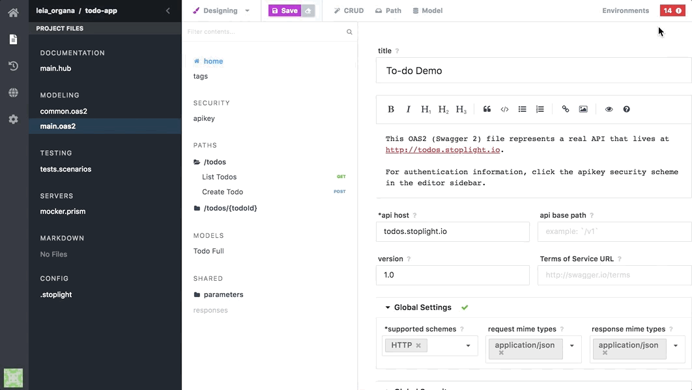

# Spec Validation

## What
Spec validation is the process of verifying the underlying OAS file syntax by making sure it conforms to the [Open API Specification requirements](https://github.com/OAI/OpenAPI-Specification#the-openapi-specification) provided by the [OpenAPI Initiative](https://www.openapis.org/). Stoplight immediately validates any changes done to a spec to ensure they are in the correct format prior to being saved.   

For more information on why these validations are necessary, please see [File Validations](../editor/file-validations.md).

## How 
1. Create a project 
2. Create a new Modeling file 
3. ...
