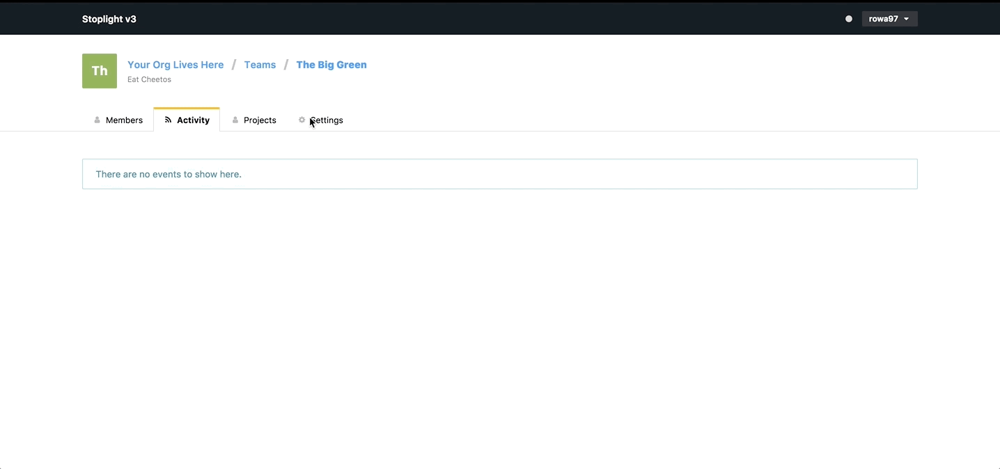

# Customize a Team 

## What 

* You can customize the Team Name, Path, and Team Description 

## Who 

* Only Team **Owner** or **Administrator** can customize a Team

## How

1. From the homepage select the **Organization** associated with the Team you wish to modify 
2. Select **Teams** from the tab bar 
3. From the Teams homepage select the Team you wish to customize
      * Then select **Team Settings** from the tab bar 
          * Input a new Team Name in the textarea under **Team Name**
          * Input a new Team URL in the textarea under **Path**
          * Input a new Team Description in the textarea under **Description**   
