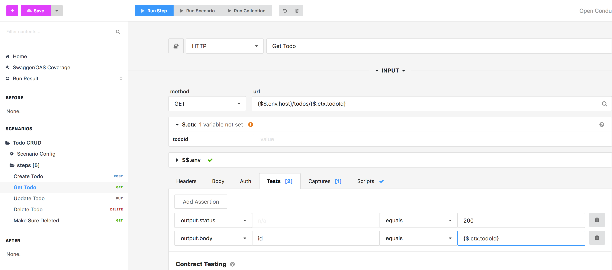
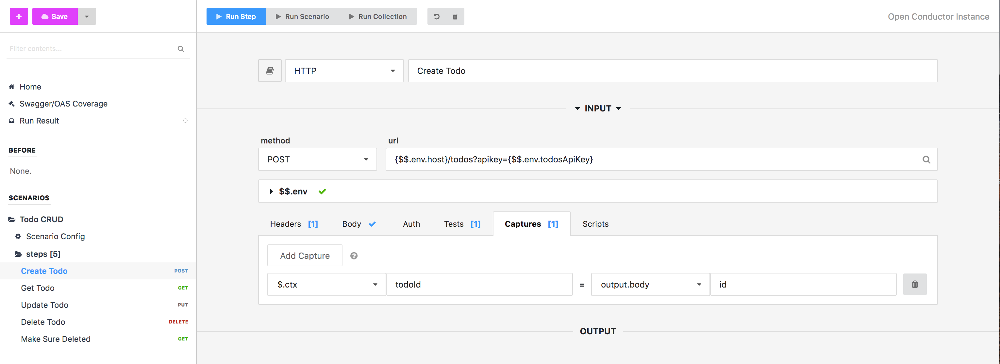
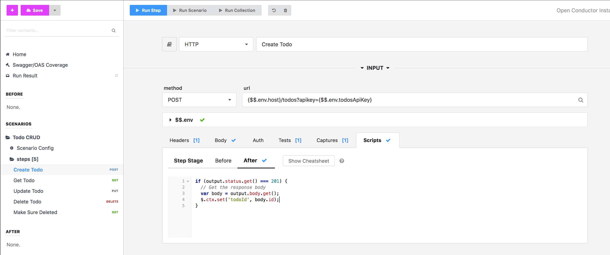
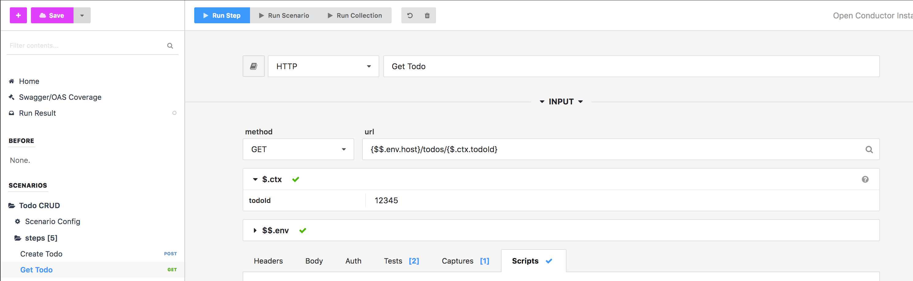

Most scenarios will involve more than one step, and oftentimes you will need to share data between the steps.

For example, imagine a simple scenario that tests the CRUD operations on a "todos" model. It might involve 5 steps:

1. CREATE /todos
2. GET /todos/{todoId}
3. PUT /todos/{todoId}
4. DELETE /todos/{todoId}
5. GET /todos/{todoId} (to make sure 404 not found)

In order for this to work, steps 2-5 need to be able to access the `id` of the newly created todo in step 1. To do this, we'll save the new `id` property in step 1 to the $.ctx object.

### The $.ctx object

The $.ctx object makes it easy to store temporary data for use during the course of a single scenario run. It starts empty at the beginning of every run. Use it to share data between steps.

### Using the $.ctx object

To use a ctx variable in your scenario, simply use the {$.ctx.variableName} syntax. For example, if your ctx variable is called `todoId`, and you want to use it in your step's URL, you would do something like this:

`/todos/{$.ctx.todoId}`

When the step is run, `{$.ctx.todoId}` will be replaced by whatever $.ctx.todoId has been set to in a previous step.

You can use variables anywhere in your step, including url, auth, headers, request body, assertions, captures, and scripting.

To use environments in a before, after script, or step with type script:

```js
// would print the postId
console.log($.ctx.get('todoId');
```

In the screenshot below, we are using a `todoId` ctx variable that is set in a previous step. It is helping us create the URL, and is also used in a test assertion to make sure that the API request responds with the exact id we are requesting.



### Setting ctx variables

#### With Captures

Save values from your step to your ctx object, for use in subsequent steps.

To accomplish this, open up the Captures tab of one of your steps and select $.ctx on the lefthand side of the assignment. In the image below we are saving the todoId property of the Create Todo response back to a variable on our ctx called `todoId`. We will use this variable in subsequent steps.



#### With Scripting

When you need more complicated conditional logic or processing, scripting is the way to go. Scripts are plain javascript, and give you access to the $.ctx object. In the screenshot below, we are accomplishing the exact same thing as with the capture screenshot above.



### When to use ctx variables

You can think of ctx variables as temporary state in your scenario. In general, we recommend using them for values that are created during the course of a single scenario, that need to be shared with subsequent steps. This includes things like ids, usernames, and randomly generated tokens.

We do **NOT** recommend using ctx variables for more permanent values that need to persist across scenario runs. For this persisted value use case, we recommend using the $$.env object, which is explained in detail [here](variables-environment.md).

### Debugging ctx variables

$.ctx variables can be manually set when running a step. This is useful if you are trying to debug a single step in the middle of a scenario, that relies on a ctx value set in a previous step. Instead of having the run the entire scenario to generate the needed ctx value, you can set it in the UI manually. In the screenshot below, we can set the todoId ctx variable before running the step to debug what would happen with a particular todoId value.



---

**Related**

* [Variables Overview](variables-overview.md)
* [Context Variables](variables-context.md)
* [Variables Environment](variables-environment.md)
