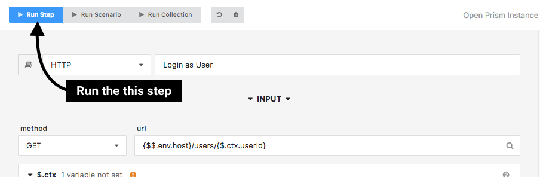
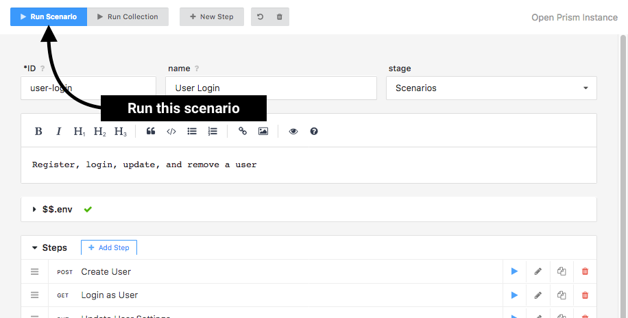
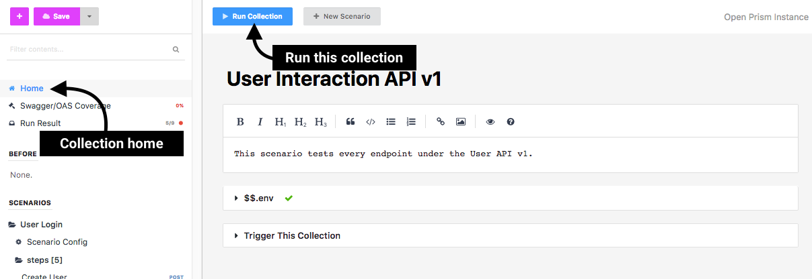

# Running Scenarios

Scenarios allow you to quickly and efficiently test APIs. Scenarios can be
run in a variety of different ways, including from the [command-line with
Prism](./run-test-terminal.md) or by [URL](./run-test-url). However, the easiest
way is through the Stoplight editor.

<!-- theme: info -->

> If you haven't created your first scenario yet, please [do so before
> continuing](./scenarios-introduction.md)

Scenarios in Stoplight are composed of three different levels:

* **Steps**: low-level building blocks that compose a scenario.
  Steps allow you to easily chain individual actions (e.g., performing a
  web request) together, enabling for more complex testing workflows.
* **Scenarios**: a series of **steps** that perform a high-level
  action (e.g., registering a new user).
* **Collections**: a series of **scenarios** that encapsulate an
  entire test suite. Collections are the highest-level building blocks for creating
  a library of API interactions and tests.

Each level above can be run individually or all together.

## Running a Step

Once you have created a scenario **step**, you can run a single step by using
the **Run Step** button available towards the top of the editor while viewing
that step.

## Running a Scenario

Once you have added enough steps to a **scenario**, you can run an single
scenario using the **Run Scenario** button available while viewing the scenario
configuration/overview.

<!-- theme: info -->

> Scenarios can also be run directly from every step using the **Run Scenario**
> button

## Running a Collection

Once you have added created enough scenarios to compose a **collection**, you
can run the entire collection (all scenarios and steps within them) by using the
**Run Collection** button available while viewing the collection home screen.

<!-- theme: info -->

> Collections can also be run from the scenario and step screens using the **Run
> Collection** button

---

**Related**

* [Scenarios Overview](./scenarios-introduction.md)
* [Running Scenarios from the Command-Line](./run-test-terminal.md)
* [Running Scenarios by URL](./run-test-url.md)
