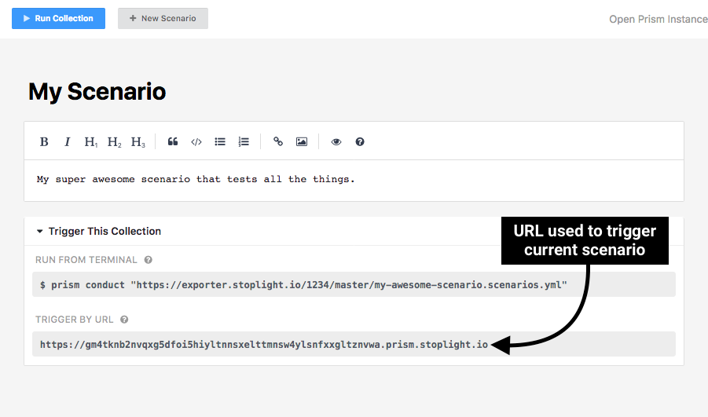

# Triggering Scenarios by URL

In addition to being able to run tests [through Stoplight](./run-test-stoplight.md) and [the terminal](./run-test-terminal.md),
scenarios can also be run by issuing a HTTP request.

To trigger a scenario by URL, there are two methods:

* Issuing a HTTP `GET` request, which runs the collection with the project's default
  settings and configuration.

* Issuing a HTTP `POST` request, which runs the collection with variables
  populated by the request's JSON body. This is necessary if you have passwords
  or other sensitive pieces of data that are not stored in Stoplight, but are
  required for running the scenario.

## Finding the Scenario URL

Every scenario has a unique URL that can be used to remotely trigger the
scenario. To find this URL:

* Go to the scenario's summary in Stoplight

* Below the scenario summary is a "Trigger This Collection" section

* Within this section is a "Trigger by URL" containing the URL unique to this
  scenario



## Triggering Scenarios

If the scenario is part of a public project and does not require any
customization to be run, then it can be triggered by issuing a simple HTTP `GET`
request to the scenario's URL, as shown below.

```bash
$ curl 'https://oihdflk5hiyltnnsxelttmnsw4ylsnfxxgltznvwa.prism.stoplight.io/'
{
  "status": "completed",
  "failCount": 3,
  "passCount": 6,
  "time": 555.3748400000001,
  "env": {
      ...
```

To customize the scenario's variables (i.e., to add passwords and other sensitive
information), they can either be included as URL query parameters in the `GET`
request, or included within the request body of a `POST` request.

### Customizing Variables with Query String Parameters

You can customize the variables included in the scenario at runtime by adding
extra [query string parameters](https://en.wikipedia.org/wiki/Query_string) to
the URL.

For example, if you have an `api_token` variable that is required to run your
scenario, it can be added to the scenario by attaching the `?api_token=abc123`
query string to the URL (where `abc123` is the value of the `api_token`
variable).

### Customizing Variables with a HTTP POST Body

In addition to adding a query string parameter, scenario variables can also be
updated by using a HTTP `POST` request instead of a `GET` request. When using
this method, the `POST` body must be composed of JSON with the JSON keys
corresponding to the variables within the scenario.

Similar to the example above, if you have an `api_token` variable that is
required to run your scenario, issuing a HTTP `POST` with the following JSON
body will inject the variable into the scenario runtime.

```json
{
  "api_token": "abc123"
}
```

To issue a `POST` request from the CLI, you can use the `curl` command. For
example:

```bash
$ curl -XPOST \
     --data-binary '{"api_token":"abc123"}' \
     'https://oihdflk5hiyltnnsxelttmnsw4ylsnfxxgltznvwa.prism.stoplight.io/'
{
  "status": "completed",
  "failCount": 3,
  "passCount": 6,
  "time": 555.3748400000001,
  "env": {
      ...
```

### Triggering Scenarios in Private Projects

Public project scenarios can be triggered directly through the scenario URL with
no further action needed. Private projects, however, must have an API token
specified so that the request can be authenticated properly. To generate a new
API token for your Stoplight acccount, see
[here](https://next.stoplight.io/profile/access-tokens).

Once you have an API token, set it under the `Private-Token` header in order for
it to be used to authenticate with the Stoplight API. For example:

```bash
$ curl -H 'Private-Token: H4BTDASDf5sGHMWJSfE32' ...
```

<!-- theme: warning -->

> Be sure to keep all private tokens safe! They can be used to authenticate
> requests with any project that your account has access to.

---

**Related**

* [Running Scenarios through Stoplight](./run-test-stoplight.md)
* [Running Scenarios from the Terminal](./run-test-terminal.md)
